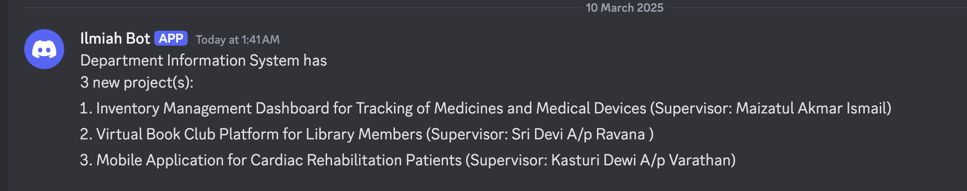
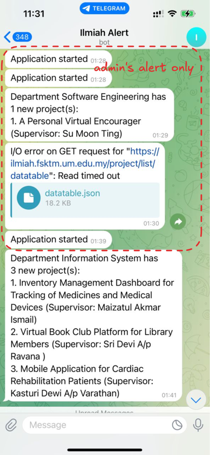
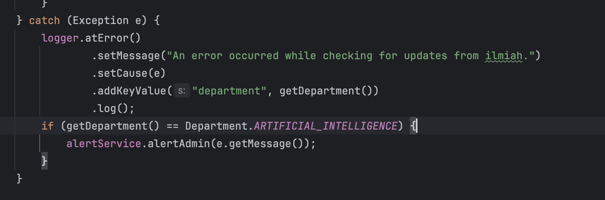

# Ilmiah Alert

A notification service that monitors updates on [ilmiah.fsktm.um.edu.my](https://ilmiah.fsktm.um.edu.my) and alerts subscribers about changes in real-time.

## Problem Statement

As students at FSKTM (Faculty of Computer Science and Information Technology), University of Malaya, we often face challenges with delayed or missing announcements about important project updates. This can lead to:

- Missing critical updates and falling behind peers
- Increased anxiety and FOMO
- Wasted time repeatedly checking the platform for changes

Ilmiah Alert solves this problem by automatically monitoring the Ilmiah platform and sending immediate notifications when changes are detected.

## Features

- **Real-time Monitoring**: Checks for updates on Ilmiah every 120 seconds
- **Multi-department Support**: Tracks projects across all FSKTM departments:
  - Software Engineering
  - Computer System and Network
  - Multimedia
  - Artificial Intelligence
  - Information System
  - Islamic Studies
- **Smart Notifications**: Alerts only when actual changes are detected
- **Multi-platform Alerts**: Delivers notifications via:
  - Telegram Bot
  - Discord Webhooks

## Sample Notification

When changes are detected, subscribers receive messages like:



## Tech Stack

- **Backend**: Java 21 with Spring Boot 3.2.7
- **Monitoring**: Spring Actuator with Prometheus metrics
- **Logging**: Logback with JSON formatting
- **Deployment**: Containerized with Docker on [Render.com](https://render.com)

## Architecture

The application follows a microservice architecture:

1. **Checker Services**: Department-specific services that monitor for changes
2. **Alert Service**: Handles notification delivery to subscribers 
3. **External Clients**: Integration with Ilmiah API and notification platforms
4. **Subscriber Management**: CSV-based subscriber list handling

## Getting Started

### Prerequisites

- JDK 21
- Maven (or use the included Maven wrapper)

### Configuration

Set the following environment variables:
```
telegram-bot-token=your-telegram-bot-token 
admin-telegram-id=your-admin-telegram-id 
discord-webhook-id=your-discord-webhook-id 
discord-webhook-token=your-discord-webhook-token
```

## Deployment
The application is deployed on Render.com's free tier, providing **container-based hosting**. Due to free-tier limitations, the service may experience cold starts and occasional downtime.

## Future Improvements
1. **Subscriber Management UI**: Create a frontend interface for self-service subscription management
2. **Additional Notification Channels**: Exploring options for more delivery platforms
- Email notifications (via free email services)
- WhatsApp integration (if feasible without paid APIs)
- Web push notifications
3. **Enhanced Analytics**: Track and visualize department update frequency
4. User Preferences: Allow subscribers to select specific departments/projects
5. Content Filtering: Smart filtering to prioritize important updates

### Challenges
- Most messaging platforms require payment for advanced API usage
- Maintaining the service with free-tier limitations
- Ensuring reliability despite external API dependencies

## Contributing
Contributions are welcome! Feel free to submit pull requests or open issues for bugs and feature requests.

## Contact
Project maintained by @yangding14<br>
.<br>
.<br>
.<br>
.<br>
.<br>
.<br>
.<br>
.<br>
.<br>
.<br>
.<br>
.<br>
.<br>
.<br>
.<br>
.<br>
.<br>
.<br>
.<br>
.<br>
.<br>
.<br>
.<br>
.<br>
.<br>
.<br>
.<br>
.<br>
.<br>
.<br>
.<br>
.<br>
.<br>

yes i'm an AI student
